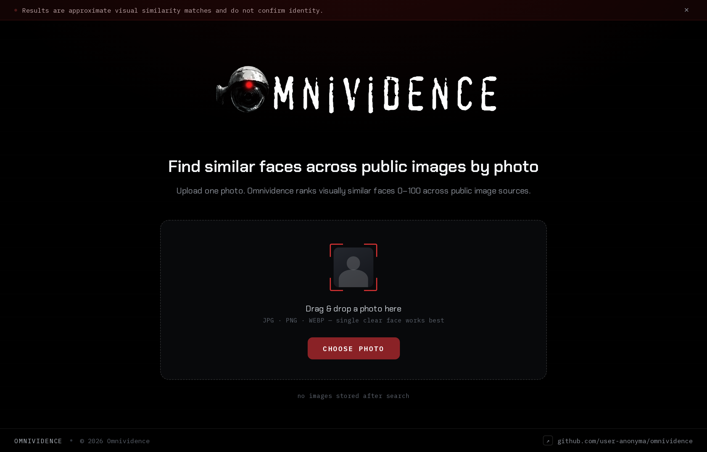
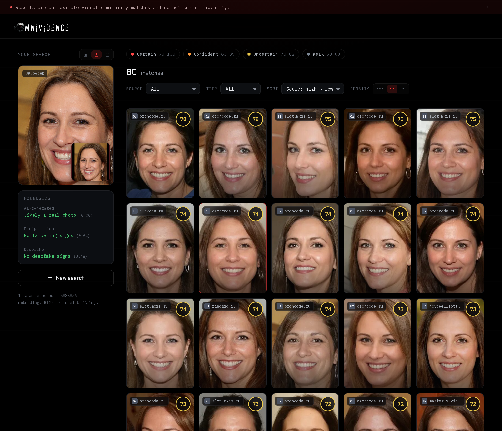
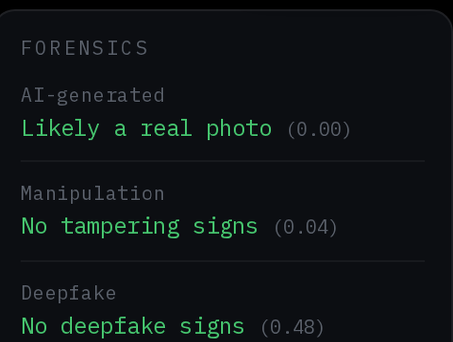

**An OSINT reverse face search tool, built for research.**

Omnividence takes a single photo of a person and finds where that face surfaces across public image sources, then ranks every hit by how strongly it lines up with the face you started from. On top of the search, it runs a forensic pass on the image you give it and tells you whether the photo was generated by AI, whether it has been digitally manipulated, and whether it carries the signature of a deepfake.

Everything runs locally. No external search APIs, no keys.



## Capabilities

**Reverse face search.** Omnividence locates the strongest face in your upload, isolates it, and encodes it into a 512 dimensional face embedding using InsightFace. That embedding is the fingerprint it hunts with. It drives a real browser against public reverse image engines, pulls back candidate images, re detects a face in each one, and scores it against your subject by cosine distance. The output is a confidence from 0 to 100, sorted strongest first.

**AI generation detection.** Every image is passed through a Swin transformer classifier trained to separate real camera photography from synthetic imagery produced by diffusion and GAN models. It returns how likely the image was machine generated.

**Manipulation detection.** The frame is examined for local editing using error level analysis, noise floor consistency, and JPEG ghost analysis. Spliced, cloned, or pasted regions leave compression and noise fingerprints that break from the rest of the image, and those breaks are what gets surfaced.

**Deepfake detection.** The detected face is cropped out and run through a Vision Transformer trained on real and face manipulated imagery, flagging face swaps and synthetic faces specifically, separate from the whole image AI check above.

**Source attribution and filtering.** Each result is traced back to the actual site it came from, not just the search engine, and tagged by platform such as Instagram, LinkedIn, or Facebook. You can filter the result set by source, filter by confidence tier, and sort the ranking however you want.

## The search view



The left rail holds your subject and the live forensic readout. The grid is the ranked match set, each tile carrying its confidence score and origin site.

## Forensic readout



Three independent verdicts on the image you uploaded, scored and color coded at a glance.

## How it works

1. You upload a photo.
2. InsightFace detects the largest face, crops it, and encodes it into a 512 dimensional embedding.
3. The face is queried against public reverse image engines through a real headless browser. No API keys are involved.
4. Every candidate image is re detected for a face and scored against your subject by cosine similarity, mapped to 0 to 100.
5. In parallel, the upload is run through the AI generation, manipulation, and deepfake checks.
6. Matches are deduplicated, traced to their source sites, ranked, and streamed back as they come in.

## Stack

Next.js on the front, FastAPI on the back. InsightFace for face detection and embeddings, onnxruntime for the forensic models, Scrapling for browser automation, SQLite for the result and thumbnail cache.

## Running it

Requires Python 3.10 or newer and Node.js 18 or newer.

```bash
git clone https://github.com/user-anonyma/omnividence.git
cd omnividence
bash install.sh
```

Start the two servers in separate terminals:

```bash
# backend, http://localhost:8000
source backend/.venv/bin/activate && cd backend && python main.py

# frontend, http://localhost:3000
cd frontend && npm run dev
```

Open http://localhost:3000 and upload a face photo. On the first run the face and forensic models download once and are cached locally.

## Research use

Omnividence is built and shared for research and educational purposes only.
